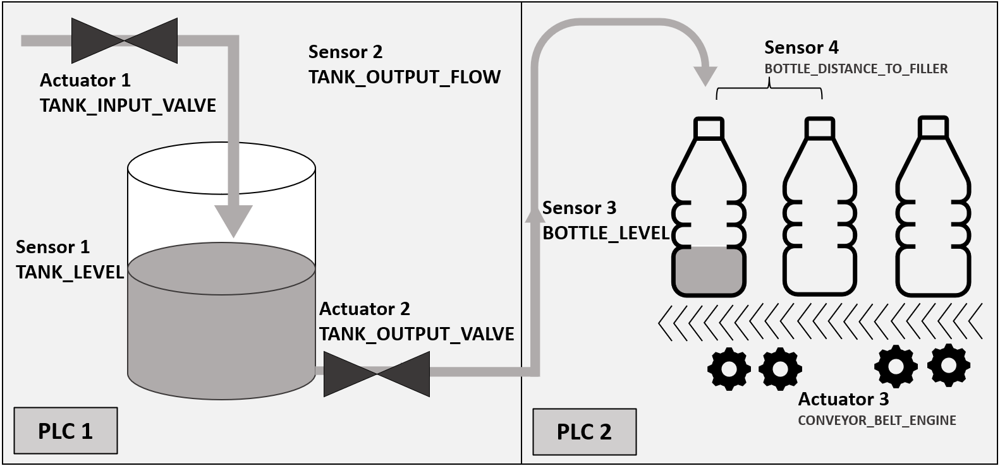
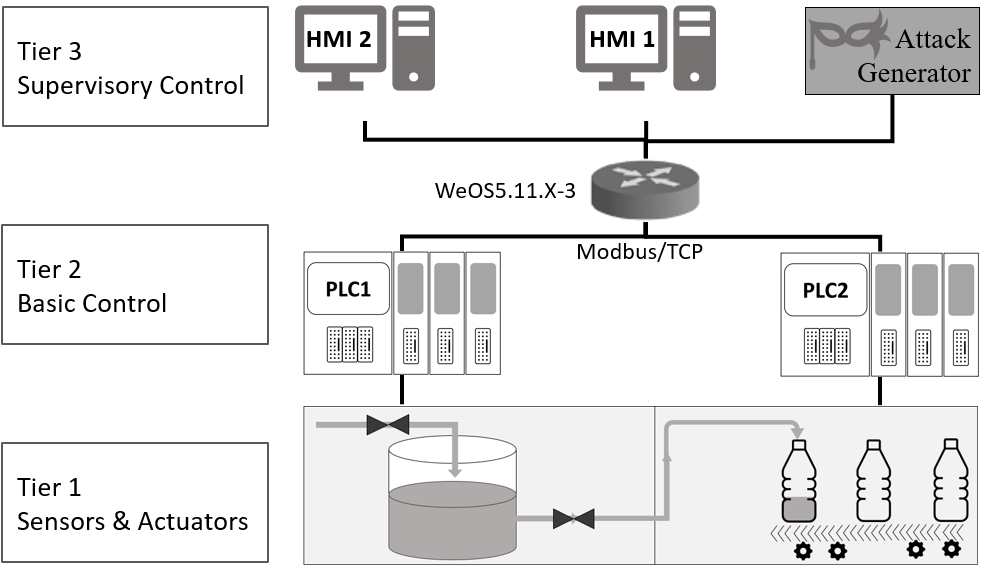

# ICSSIM
This is the ICSSIM source code and user manual for simulating industrial control system testbed for cybersecurity experiments.

The ICSSIM framework enables cyber threats and attacks to be investigated and mitigated by building a virtual ICS security testbed customized to suit their needs. As ICSSIM runs on separate private operating system kernels, it provides realistic network emulation and runs ICS components on Docker container technology. 

ICSSIM can also be used to simulate any other open-loop controlling process, such as bottle filling, and allows us to build a testbed for any open-loop controlling process.

# Sample Bottle Filling Factory
A water tank repository is used to fill bottles during the bottle-filling factory control process. The below figure shows the overall scenario including process and hardware. The proposed control process consists of two main hardware zones, each managed by a standalone PLC, called PLC-1 and PLC-2. The water tank and valves are controlled by PLC-1. The conveyor belts are controlled by PLC-2 to switch out filled bottles with empty ones.


An overview of the bottle filling factory network architecture is presented below. In the proposed network architecture, the first three layers of the Purdue reference architecture are realized. In Docker container technology, shared memory is used to implement the hard wired connection between Tiers 1 and 2. To simulate the network between Tiers 2 and 3, a Local Area Network (LAN) is created in a simulation environment. The attacker is also assumed to have access to this network as a malicious HMI, therefore we consider this node as an additional attacker in this architecture.




# Run a Sample Bottle Filling Factory

## Run in Docker container Environement

### Pre steps
Make sure that you have already installed the following applications and tools. 

* git
* Docker
* Docker-Compose

### Getting ICSSIM and the sample project
Clone The probject into your local directory using following git command.
```
git clone https://github.com/AlirezaDehlaghi/ICSSIM ICSSIM
```

check the file [Configs.py](src/Configs.py) and make sure that EXECUTION_MODE varibale is set to EXECUTION_MODE_DOCKER as follow:
```
EXECUTION_MODE = EXECUTION_MODE_DOCKER
```

### Running the sample project 
Run the sample project using the prepared script 
[init.sh](deployments/init.sh)
```
cd ICSSIM/deployments
./init.sh
```
### Check successful running
If *init.sh* commands runs to the end, it will show the status of all containers. In the case that all containers are 'Up', then project is running successfully.
You could also see the status of containers with following command:
```
sudo docker-compose ps
```

### Operating the control system and apply cyberattacks
In the directory [deployments](deployments/) there exist some scripts such as [hmi1.sh](deployments/hmi1.sh), [hmi2.sh](deployments/hmi2.sh) or [attacker.sh](deployments/attacker.sh) which can attach user to the container.

## Run in GNS3
To run the ICSSIM and the sample Bottle Filling factory clone the prject and use the portable GNS3 file to create a new project in GNS3.

### Getting ICSSIM and the sample project
Clone The probject into your local directory using following git command.
```
git clone https://github.com/AlirezaDehlaghi/ICSSIM ICSSIM
```

### Import Project in GNS3
Import the portable project ([deployments/GNS3/ICSSIM-GNS3-Portable.gns3project](deployments/GNS3/ICSSIM-GNS3-Portable.gns3project)) using menu **File->Import Portable Project**

## RUN as a single Python project

### Pre steps
Make sure that you have already installed the following applications and tools. 

* git
* Python
* pip

Make sure that you installed required packages: pyModbusTCP, memcache
```
pip install pyModbusTCP
pip install memcache

```


### Getting ICSSIM and the sample project
Clone The probject into your local directory using following git command.
```
git clone https://github.com/AlirezaDehlaghi/ICSSIM ICSSIM
```

check the file [Configs.py](src/Configs.py) and make sure that EXECUTION_MODE varibale is set to EXECUTION_MODE_DOCKER as follow:
```
EXECUTION_MODE = EXECUTION_MODE_LOCAL
```

### Running the sample project 
Run the sample project using the running start.py
```
cd ICSSIM/src
python3 start.py
```
